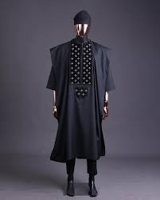
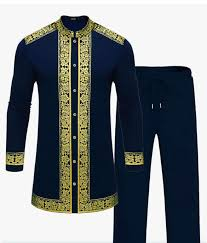
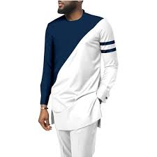

<!DOCTYPE html>
<html lang="en">
<head>
<meta charset="UTF-8">
<meta name="viewport" content="width=device-width, initial-scale=1.0">
<title>CYPRIANS - Online Clothing Store</title>

</head>
<body>

<!-- Header -->
<header>
  <h1>ROYAL HACKER</h1>

  <h1>CLEAN WEAR AROUND</h1>  <h1>CYPRIAN HUMBLE company</h1>
  

    <button onclick="openModal('loginModal')">Login</button>
    <button onclick="openModal('signupModal')">Sign Up</button>
  

</header>

<!-- Shop Section -->
<section class="shop">
  <h2>Our Latest Collection</h2>
  

    

      
      <h3>Classic full-african wear</h3>
      
A black African full suit.

      
ksh.2500.00

      <button class="cart-btn">Add to Cart</button>
    

    

      
      <h3>classic T-shirt</h3>
      
Stylish cream shirt to complete your outfit.

      
ksh.1000.00

      <button class="cart-btn">Add to Cart</button>
    

    

      
      <h3>Summer outfit</h3>
      
full wear to shine with.

      
ksh.1045.00

      <button class="cart-btn">Add to Cart</button>
    

    

      
      <h3>Black cotton shirt</h3>
      
Durable and elegant black clothing.

      
ksh.1280.00

      <button class="cart-btn">Add to Cart</button>
    

    

      
      <h3>Hooded wear</h3>
      
perfect warmth and comfort clothing.

      
ksh.1235.00

      <button class="cart-btn">Add to Cart</button>
    

  

</section>

<!-- Login Modal -->

  

    &times;
    <h2>Login</h2>
    <form id="loginForm">
      <input type="text" placeholder="Username" required> 
      <input type="password" placeholder="Password" required> 
      <button type="submit">Login</button>
    </form>
  

<!-- Signup Modal -->

  

    &times;
    <h2>Create Account</h2>
    <form id="signupForm">
      <input type="text" placeholder="Username" required> 
      <input type="email" placeholder="Email" required> 
      <input type="password" placeholder="Password" required> 
      <button type="submit">Sign Up</button>
    </form>
  

</body>
</html>

